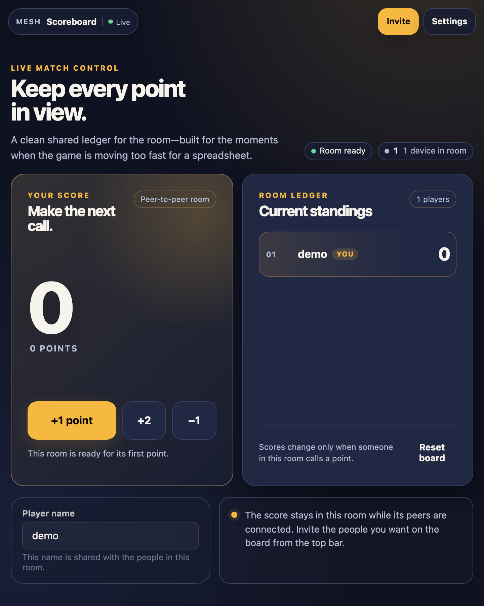
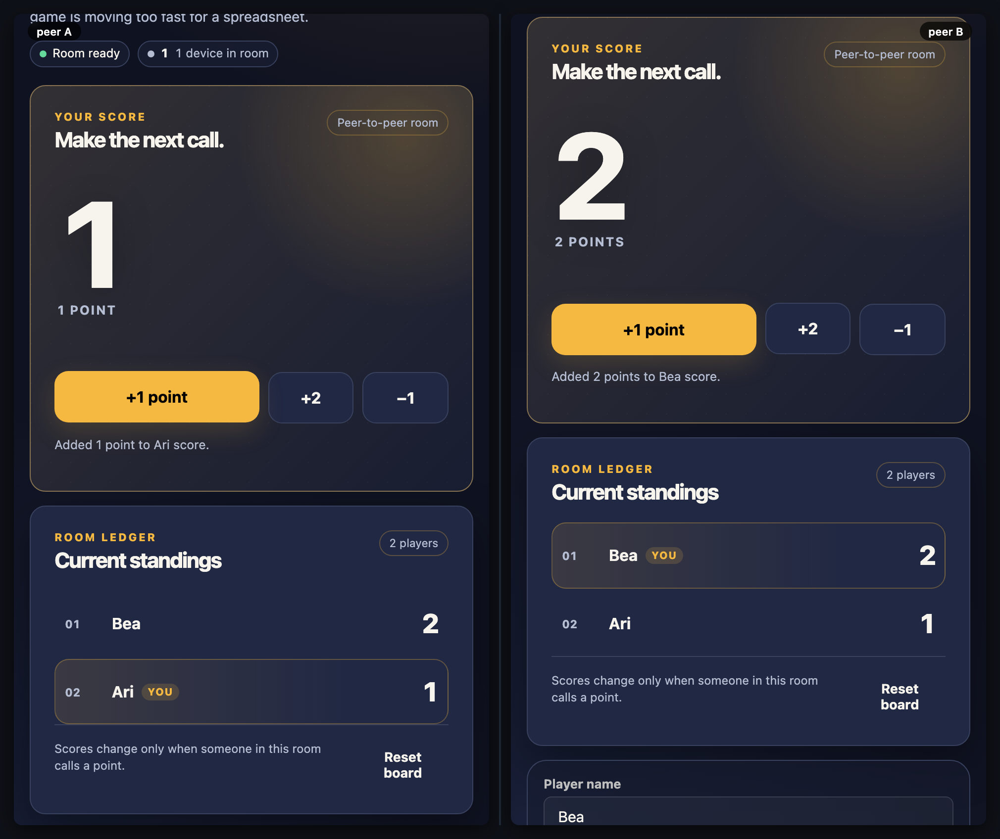
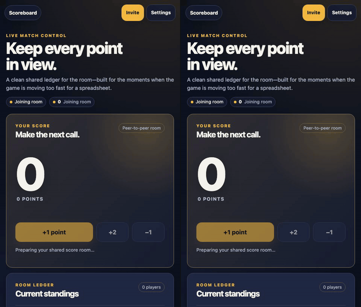

# Scoreboard

[](https://baditaflorin.github.io/mesh-scoreboard/)
[](./LICENSE)

> A focused, peer-to-peer match board that makes every score change visible to the people in the room.

**Live → [baditaflorin.github.io/mesh-scoreboard](https://baditaflorin.github.io/mesh-scoreboard/)**





## What it does

Scoreboard is a deliberate alternative to passing a phone around or opening a busy spreadsheet during a game. Choose the room from Settings, add your player name, and call points. Each player can adjust their own score; the ordered ledger is derived from the shared Yjs score map and updates for every connected peer.

- `+1`, `+2`, and `−1` change your own score only.
- Player names are published to the people in the selected room so the ledger is attributable.
- Reset is a two-step action because it clears the shared board for everyone in the room.
- There is no account, server-side score database, or simulated sync state.

The board is intentionally ephemeral: its shared state exists while the room has connected peers. Use the top-bar **Invite** action to bring another device into the same room.

## A real two-peer interaction



The recorded demo runs two browser peers in the same room: Ari adds one point, Bea adds two, and both ledgers render the same standings.

## Run it locally

`mesh-common` must be a sibling directory because this app consumes it through `file:../mesh-common`.

```bash
git clone https://github.com/baditaflorin/mesh-common
git clone https://github.com/baditaflorin/mesh-scoreboard
cd mesh-common && npm ci
cd ../mesh-scoreboard && npm ci
npm run dev
```

Open the local URL in two tabs or devices, select the same room in **Settings**, and call a point from either board.

## Verification

```bash
npm run fmt:check
npm run typecheck
npm run test:unit
npm run smoke
npm run test:e2e
MESH_RUN_LEAK_TEST=1 MESH_LEAK_DURATION_MS=5000 npm run test:leak
npm audit
npm run audit:security
```

The end-to-end suite proves that two browser peers receive the same score map, checks phone and short-desktop first viewports, and captures test screenshots. To regenerate public demo assets:

```bash
npm run screenshot
npm run demo
```

`npm run audit:security` writes a current public report to [docs/security-audit.md](docs/security-audit.md).

## Privacy and infrastructure

The room ID is the access boundary: anyone in a room can see all player names and scores shared there. The self-hosted signaling and TURN services broker connectivity, but do not hold a server-side score database. Read the full [privacy note](docs/privacy.md) before using a room with people you do not know.

## Deployment

GitHub Pages serves the committed `docs/` directory from the repository’s default branch. The project uses Woodpecker for CI; it intentionally has no GitHub Actions workflow.

## License

MIT — see [LICENSE](LICENSE).
